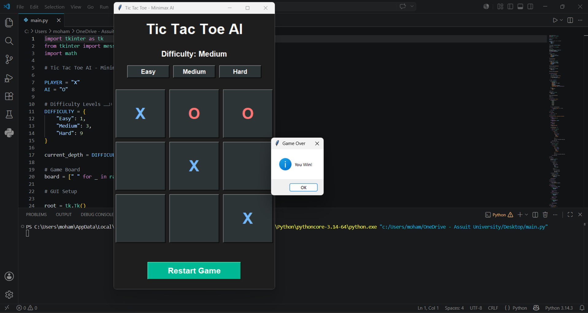

# Tic Tac Toe AI using Minimax Algorithm

This project is a Tic Tac Toe game developed using Python and Tkinter GUI.

The AI opponent uses the Minimax Algorithm to make intelligent decisions.

---

## Features

- GUI using Tkinter
- AI Player using Minimax Algorithm
- 3 Difficulty Levels
  - Easy
  - Medium
  - Hard
- Restart Button

---

## Difficulty Levels

The difficulty changes based on the Minimax search depth.

| Difficulty | Depth |
|---|---|
| Easy | 1 |
| Medium | 3 |
| Hard | 9 |

---

## Technologies Used

- Python
- Tkinter
- Minimax Algorithm

---

## How to Run

```bash
python main.py
```

---

## Screenshot


